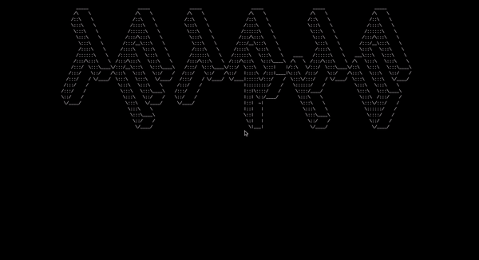

# Tetris - PLP 

## What's ?

A tetris-like game implemented in 2 different languages (C++, Haskell).

## How to play 

The game is played in terminal and commands can change for different languages but the whole UI and logic is the same, there
are more precise instructions on each folder.

## Demo

## Developed by:

* [Hugo Addobbati](https://github.com/hugoaddobbati)
* [Katson Matheus](https://github.com/katson1)
* [Arthur Silva](https://github.com/arthur1silva)
* [Felipe Mota](https://github.com/fmota0)
